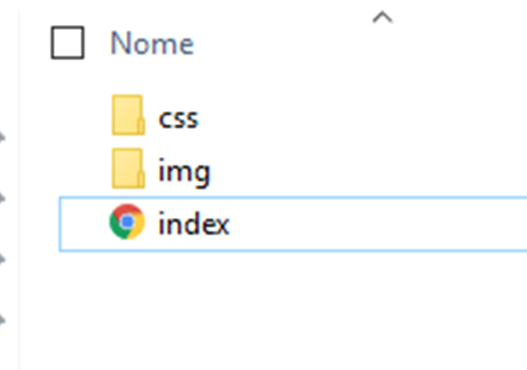

MARKDOWN PREVIEM ENHANCED

# Plano da aula

* O que é HTML + CSS e estrutura da pasta
* Editor de texto
* Tags do Html
* Aprendendo o famoso Css

## O que é ?

#### HTML
HTML é a linguagem usada para fazer a marcação do seu site, ou seja, mostrar para o navegador o que é um título, um texto, um link etc. Para mim, é como se fosse o esqueleto do site
#### CSS
Já o CSS fala para o navegador o estilo dessa marcação. Queremos colocar o texto em branco, colocar uma imagem de fundo, mudar a fonte do título? Isso tudo se faz pelo CSS. Para mim, é como se fosse a maquiagem para o seu site...

## Estrutura da pasta 

#### INDEX.HTML
É o arquivo principal 

#### PASTA CSS
 
 Onde fica todos os arquivos de styles (estilos) do site, como se fosse uma ‘’maquiagem’’ para o esqueleto...

#### PASTA IMG 
Onde salvamos as imagens



## Tags, o que é ?

As TAG's são a base para a linguagem HTML. Elas são instruções para informar ao navegador como deve ser apresentado o site. Ou seja, quando começo a escrever HTML estou escrevendo TAG's que serão interpretadas pelo navegador, produzindo assim o visual do seu site. 

Ela é composta por uma **tag de abertura**, seu conteúdo, e a **tag de fechamento**. No exemplo, estou marcando que o Um texto” é um parágrafo. 

Tipos de tags:

```html
<p> Um texto </p>
```

Tag para colocar um link:

```html
<a href="gooogle.com"> Site google</a>
```
> Algumas vezes, as tags de abertura recebem atributos. Atributos são propriedades auxiliares de uma tag. Nesse exemplo, marcamos que o texto “Visite o Google” é um link, que, ao clicado, levará o usuário ao google.com. O atributo é href e o valor do atributo é google.com.

Tag para colocar imagem:

```html

```
> Outras vezes, as tags não terão tag de fechamento. A tag img é um bom exemplo, porque ela não possui um conteúdo interno, ela é o próprio conteúdo. Ela recebe atributos específicos para determinar o caminho da imagem e a descrição dela 

Tag para colocar título:

```html
<h1> Seu título aqui</h1>
```
E essa tag tem váriações:

```html
<h2> </h2>
<h3> </h3> ... 

```

Indo até ao h6, essa váriação é devida aos tamanhos

# Esse é um h1
## Esse é um h2
### Esse é um h3

E assim por diante...

ADICIONAR TABELA DE ELEENTOS

# HORA DE PROGRAMAR


Vamos começar pela a estrutura básica do html:

```html
<!DOCTYPE html>
<html lang="pt">
<head>
    <!-- Informações que não são lidas para o nosso usuário final -->
    <!-- Exemplos: Palavras chaves para a busca do site, Título da abinha no navegador -->
    <meta charset="UTF-8"> <!-- Serve para o navegador entender os nossos acentos, ´^~  -->
    <title>Título do site</title> 

</head>
<body>
    <!-- Já dentro do Body(Corpo) é onde fica o conteúdo onde o usuário consegue visualizar -->
    <!-- Exemplos: links, imagens, botões para clicar -->
</body>
</html>
```
> Isso tudo em verde, se chama comentário, ele não aparece no navegador (navegador temos como exemplo o google), o comentário é como se fosse o post its do código :D

Depois dessa estrutura inicial, vamos colocar o conteúdo dentro do body:

```html

<!DOCTYPE html>
<html lang="en">
<head>
    <meta charset="UTF-8">
    <title>Título do site</title>
</head>
<body>
    <header>
        <h1> 
            Oi, meu nome é Carol
        </h1>
        <p>
            Conheça mais sobre mim
        </p>
        <button>
            Veja mais sobre mim
        </button>
    </header>
</body>
</html>
```
> Adicionamos acima o ```h1, p``` e um ```button ```.

### Ao voltar na pasta do projeto e clicar em index.html, sua página estará assim: 


Mas, precisamos agrupar esses elementos...

> Para agrupar elementos, utilizamos as famosas  divs...

```html
<!-- HEADER BANNER -->
    <div>
        <div>
            <h1>Oi, meu nome é Carol</h1>
            <p>Conheça mais sobre mim</p>
            <a href="#">Veja mais sobre mim</a>
        </div>
    </div>
```

E porque colocamos duas divs ? Vamos entender na imagem abaixo de como queremos que fique:


#### Vamos entender as cores nessa imagem:

**Vermelho**:  A cor vermelha esta simbolizando a div mãe, ela que agrupa os outros elementos

**Verde**: A cor verde simboliza a div(caixa) que esta agrupando o título, paragrafo e botão. 

E para que agrupar ? Porque seu site deve estar com essa cara: 


E queremos que ele fique:


### Então chegamos no mais esperado, o querido CSS 

> No vs code, vá em file > new file ou apert cltr + N 
> Aperte ctrl + s e salve esse arquivo na pasta css que tínhamos criado com o nome style.css

Agora, para colocar um pouco de personalidade na nossa página e também inserir a imagem de fundo da Margareth, vamos precisar da ajuda do CSS. Diferente do HTML, no CSS não há uma divisão macro, como acontece no html, head e body. Apenas selecionamos o que queremos modificar, que propriedade vamos modificar e qual o seu valor.
O esqueleto básico de uma marcação de estilo é seletor, propriedade e valor:

``` css
seletor {
    propriedade: valor
}
```

O **seletor** seleciona que elemento HTML vai ser modificado. É o seu alvo.
A **propriedade** é o que vai ser modificado. Cor, fonte, tamanho etc.
O **valor** é como vai ser modificado. Se é a cor, você pode mudar pra vermelho; se é a fonte, você pode mudar o tamanho dela.
O **seletor** inicia a chamada, sendo que a propriedade e valor sempre ficam entre {}. O valor é seguido de um ; (ponto e vírgula).

Para exemplificar, vamos modificar a cor de fundo do documento pra vermelho. Para isso, vou selecionar a tag body do HTML, com a propriedade de background-color, ou cor de fundo.

``` css
body{
    background: red;
}
```

Se você atualizar o seu site, vai dar erro porque ainda não linkamos o css ao html.

Vamos voltar ao html e adicionar a seguinte tag no head:

```html 
    <link rel="stylesheet" href="css/style.css">
```
**Resultado:**
```html
<!DOCTYPE html>
<html lang="en">
<head>
    <meta charset="UTF-8">
    <title>Título do site</title>
    <link rel="stylesheet" href="css/style.css">
</head>
```

> Existem 2 atributos obrigatórios pra essa tag. O primeiro é que relação esse link tem com o meu documento. No caso, ele é uma folha de estilo, por isso colocamos rel=”stylesheet”. Em seguida, temos que prover o caminho do arquivo, então colocamos o href, igual colocamos na tag ``` <a></a>```.

Se tudo estiver corretor, ao atualizar a página, ficará:


### 2. Vamos começar a deixar mais bonito nosso site:

Adicionaremos na primeira div do html,  a seguinte propriedade

**class="banner"**


> Utilizamos a propriedade class para podermos dar um nome ao elemento e podermos manipular ele no css

Ficará:


Voltamos ao arquivo style.css e vamos adicionar a imagem:

```css
.banner{
    background: url(../img/banner-bg.png)  center no-repeat;
    background-size: cover;
    height: 90vh;
    text-align: center;
    padding-top: 20rem;
    color: white;
}
```

> Propriedades explicadas em aula 

E nosso site vai tomando forma:


Agora vamos ajeitar primeiro essa tela, trocando as fontes para ficar igual nossa imagem inicial


Usaremos a fonte **RALEWAY** e o jeito mais fácil de encontrar, é nesse site: https://fonts.google.com/

Para adicionar uma fonte no site é necessário voltar ao html e inserir o link que selecionamos desse site:

Insira o link copiado do site abaixo do link onde esta o css, observe:


Agora voltaremos ao css para a segunda parte de adicionar:

```css

body {
    font-family: 'Raleway', Arial, Helvetica, sans-serif;
    margin: 0;
}
```

Colocamos a fonte **Raleway** e outras variantes dela que já existe no sistema, caso a raleway dÊ algum problema.

Agora vamos aumentar o tamanho das letras, centralizar o texto e ajeitar o botão ''Conheça mais sobre mim''

Vamos nomear a segunda div(caixinha) colocando uma classe:

```html
<div class="banner">
    <div class="container">
        <h1>Oi, eu sou Margaret Hamilton</h1>
        <p>Conheça mais sobre mim</p>
        <a>Veja mais sobre mim</a>
    </div>
</div>
```
E voltando ao arquivo **CSS** vamos dar estilos para essa classe:

```CSS
.container {
    margin: 0 auto; /* Retira as margens padrão do html e centraliza */
    margin-top: 10rem; /* Adiciona uma margin de cima com valor de 10 */
}
````

Vá ao navegador e atualize a página, você verá que ela estará centralizada

Agora, voltando ao html, vamos nomear os outros elementos:


Adicionamos três classes, em três elementos
> - class="banner__titulo"
> - class="banner__subtitulo"
> - class="btn btn-branco"

```html
<div class="banner">
    <div class="container">
        <h1 class="banner__titulo ">Oi, eu sou Margaret Hamilton</h1>
        <p class="banner__subtitulo ">Conheça mais sobre mim</p>
        <a class="btn btn-branco">Veja mais sobre mim</a>
    </div>
</div>
```

E vamos dar estilos para essas classes no **ARQUIVO CSS**

```css
 .banner__titulo {
    font-size: 5rem;  /* Adiciona um tamanho a fonte com respectivo valor  */
}

.banner__subtitulo {
    font-size: 2.3rem; /* Adiciona um tamanho a fonte com respectivo valor  */
}

/* BOTAO */
.btn {  
    border-radius: 3rem; /* Adiciona uma borda com espessura de 3rem */
    text-transform: uppercase; /* Trasforma o texto em caixa alta  */
    padding: 1rem 2rem;  /*Trasforma o texto em caixa alta  */
    font-size: 1.5rem;  /* Adiciona um tamanho a fonte com respectivo valor */
    font-weight: bold;  /* Transforma o texto em negrito */
}

.btn-branco {
    color: #7E459B; /*Adiciona uma cor a fonte do botão */
    background-color: white; /* Adiciona uma cor ao fundo do botão */
} 
```
#### E vocês devem pensar, porque duas classes no botão ? 
>Porque a classe **btn** seria como uma classe padrão que irá ser utilizada em outros botões, mas como temos botões de cores diferentes criamos a **btn-branco**

Volte ao navegador(Google ou o seu navegador padrão) e atualize a página (F5). Se tudo deu certo até agora, sua página deve estar mais ou menos assim:


Podemos observar que no botão tem um risco embaixo, essa característica é devido a todo link receber esse tracinho. Ele é possível ser retirar no css, então, para ficar mais bonitinho:

Vamos pegar o elemento que simboliza o link **a** e a propriedade que retira esse tracinho:  

Volte ao **arquivo CSS** e adicione

```css
a {
    text-decoration: none;
} 
```

## Seguimos para parte 2, montando a segunda parte da página.


....


## Fontes

https://cursos.alura.com.br/forum/topico-a-tag-meta-charset-utf-8-35287 -  tag
